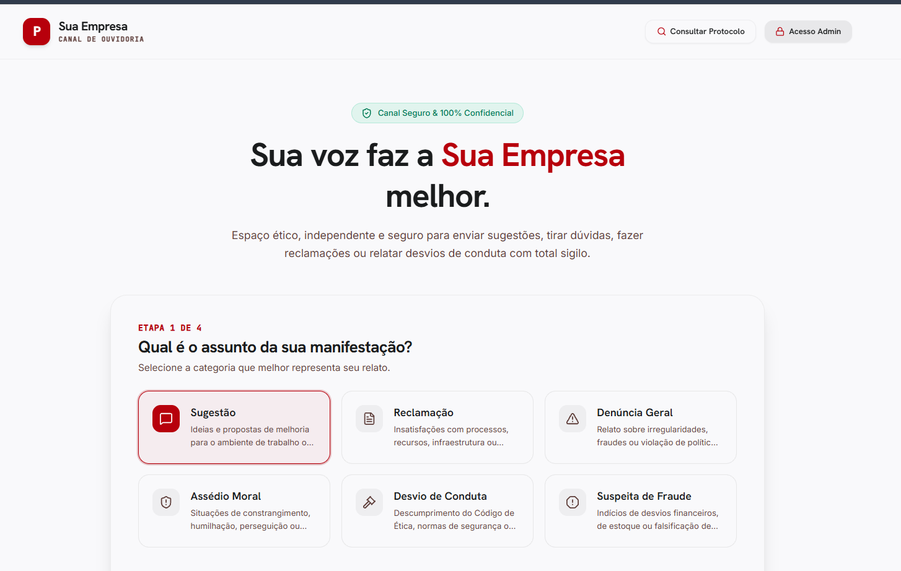
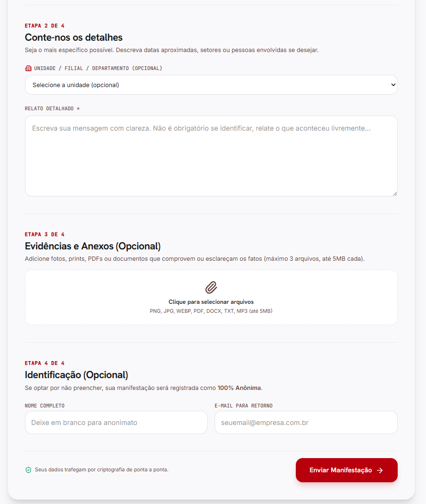
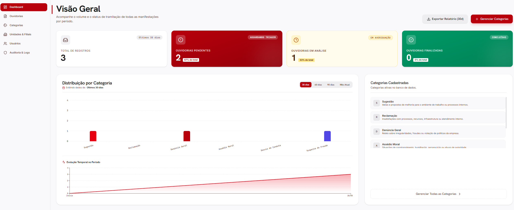

# Power Ouvidoria

Sistema web de ouvidoria e canal de ética para a **Sua Empresa**. A aplicação permite receber manifestações identificadas ou anônimas, acompanhar protocolos, anexar evidências e administrar o fluxo de tratamento em um painel protegido.

## Visão geral

- Formulário público em múltiplas etapas.
- Registro anônimo ou com nome e e-mail para retorno.
- Categorias, unidades/filiais e níveis de severidade configuráveis.
- Upload de até três anexos por manifestação.
- Consulta pública por protocolo e troca de mensagens.
- Painel administrativo com dashboard, filtros, atribuição, comentários e histórico.
- Auditoria de ações administrativas.
- Interface responsiva em português do Brasil.

## Pré-visualização

### Formulário público





### Painel administrativo



## Stack

- React 19 + TypeScript
- Vite 6
- React Router
- Tailwind CSS 4
- Supabase (PostgreSQL, Storage e RPCs)
- Recharts, Lucide React, Motion e date-fns
- Deploy compatível com Vercel ou qualquer hospedagem de arquivos estáticos

## Pré-requisitos

- Node.js 20 ou superior (npm 10+ recomendado), ou Bun.
- Um projeto Supabase configurado.
- Banco de dados com as tabelas, políticas, bucket e funções RPC descritas na seção [Integração com Supabase](#integração-com-supabase).

> Este repositório contém o frontend. As migrações SQL do banco não estão versionadas aqui; sem as tabelas e RPCs do Supabase, a página abre, mas os cadastros, login e consultas não funcionarão.

## Instalação local

```bash
git clone https://github.com/budswarez/Power-Ouvidoria.git
cd Power-Ouvidoria
npm install
```

Copie o arquivo de ambiente e preencha as variáveis:

```bash
cp .env.example .env.local
```

No Windows PowerShell, use:

```powershell
Copy-Item .env.example .env.local
```

Depois, inicie o servidor de desenvolvimento:

```bash
npm run dev
```

Acesse `http://localhost:3000`.

## Variáveis de ambiente

| Variável | Obrigatória | Descrição |
| --- | --- | --- |
| `VITE_SUPABASE_URL` | Sim | URL pública do projeto Supabase. |
| `VITE_SUPABASE_ANON_KEY` | Sim | Chave pública `anon` do Supabase. Ela pode aparecer no bundle; nunca use a `service_role` no frontend. |
| `GEMINI_API_KEY` | Opcional | Reservada para integrações futuras com Gemini; não é usada pelo fluxo atual do frontend. |
| `APP_URL` | Opcional | URL pública da aplicação, útil para configurações de ambiente/deploy. |

O Vite só expõe ao navegador variáveis prefixadas com `VITE_`. Não coloque senhas administrativas, chaves privadas ou tokens de serviço em `.env.local` ou no código do frontend.

## Integração com Supabase

### Storage

Crie um bucket público chamado `report-attachments`, ou altere as políticas e o código caso prefira URLs assinadas. O formulário envia os arquivos para esse bucket usando nomes únicos. A interface aceita PNG, JPG, WEBP, PDF, DOCX, TXT e MP3, com limite de até 3 arquivos de até 5 MB cada.

### Dados esperados

O frontend utiliza entidades compatíveis com `categories`, `branches`, `reports`, `report_comments`, `report_timeline`, `report_messages`, `admin_users` e `admin_audit_logs`. Os campos principais e os tipos TypeScript estão em `src/types/database.ts`.

### RPCs necessárias

As funções precisam validar autenticação, permissões e os parâmetros no servidor. O frontend chama:

**Fluxo público:** `rpc_public_create_report`, `rpc_public_track_report` e `rpc_public_send_message`.

**Autenticação:** `rpc_admin_login` e `rpc_admin_logout`.

**Administração:** `rpc_admin_get_reports`, `rpc_admin_get_report_detail`, `rpc_admin_update_report_status`, `rpc_admin_assign_report`, `rpc_admin_add_comment`, `rpc_admin_send_public_message`, `rpc_admin_get_users`, `rpc_admin_create_user`, `rpc_admin_manage_category`, `rpc_admin_manage_branch`, `rpc_admin_get_audit_logs` e `rpc_admin_log_audit`.

As RPCs administrativas recebem `p_token` e devem rejeitar tokens expirados, usuários inativos e operações sem permissão. O login espera uma resposta no formato `{ success, user, token, error }`; as demais respostas devem manter o campo `success` quando o código verificar esse campo.

### Segurança recomendada

- Ative RLS nas tabelas e não permita acesso direto irrestrito às tabelas administrativas.
- Faça toda autorização dentro das RPCs `SECURITY DEFINER`, validando o token no servidor.
- Restrinja upload por MIME type, tamanho e quantidade também nas políticas do Storage.
- Não use credenciais de demonstração em produção; troque o usuário inicial e a senha imediatamente.
- Configure CORS, domínios autorizados e expiração de sessão no Supabase.
- Revise a política de privacidade e retenção de dados antes de colocar o canal em operação.

## Scripts disponíveis

| Comando | Função |
| --- | --- |
| `npm run dev` | Servidor local com Vite na porta 3000. |
| `npm run build` | Compila a aplicação para produção em `dist/`. |
| `npm run preview` | Serve localmente o build de produção. |
| `npm run lint` | Verifica tipos TypeScript sem emitir arquivos. |
| `npm run clean` | Remove artefatos locais de build. |

Antes de publicar, execute:

```bash
npm run lint
npm run build
```

## Rotas

| Rota | Acesso | Uso |
| --- | --- | --- |
| `/` | Público | Registro de uma manifestação. |
| `/acompanhar` | Público | Consulta de protocolo. |
| `/consultar` | Público | Alias da consulta de protocolo. |
| `/login` | Público | Login administrativo. |
| `/admin` | Protegido | Dashboard. |
| `/admin/ouvidorias` | Protegido | Listagem de manifestações. |
| `/admin/ouvidorias/:id` | Protegido | Detalhes e tratamento. |
| `/admin/categorias` | Protegido | Gerenciamento de categorias. |
| `/admin/unidades` | Protegido | Gerenciamento de unidades/filiais. |
| `/admin/usuarios` | Protegido | Gerenciamento de usuários. |
| `/admin/auditoria` | Protegido | Trilha de auditoria. |

## Deploy na Vercel

1. Importe o repositório na Vercel.
2. Selecione o preset **Vite**; o build será `npm run build` e a saída `dist`.
3. Cadastre `VITE_SUPABASE_URL` e `VITE_SUPABASE_ANON_KEY` nas variáveis de ambiente de Preview e Production.
4. Faça um redeploy após salvar as variáveis.
5. Teste `/`, `/acompanhar`, `/login` e uma rota administrativa. O arquivo `vercel.json` já configura o fallback das rotas do React para `index.html`.

Para outros hosts estáticos, publique o conteúdo de `dist/` e configure fallback de todas as rotas para `index.html`.

## Troubleshooting

**A aplicação abre, mas não carrega categorias:** confira `VITE_SUPABASE_URL`, a chave `anon`, a tabela `categories` e suas políticas/RPCs.

**Login retorna erro de RPC:** confirme que `rpc_admin_login` existe, recebe `p_email` e `p_password` e retorna o formato esperado.

**Anexos falham:** confira o bucket `report-attachments`, as políticas de Storage e os limites de tamanho/MIME.

**Refresh de uma rota retorna 404:** configure o fallback para `index.html`; na Vercel, mantenha o `vercel.json` versionado.

**Build falha por tipos:** rode `npm run lint` e corrija o primeiro erro reportado; em seguida execute `npm run build`.

## Licença e operação

Defina a licença do projeto antes de distribuir o sistema. O conteúdo das manifestações pode conter dados pessoais e informações sensíveis; estabeleça responsáveis, prazo de retenção, controles de acesso e procedimento de resposta a incidentes.
